---
# RECONSTRUCTION, not a file issued by the course authors. See
# lectures/08_icenet-regularization.qmd for the full note on what is theirs and
# what is ours. Render with scripts/render_lecture.sh, not bare `quarto render`.
title: "Lecture 3: Deep Learning: An Overview"
subtitle: |
  | Deep Learning for Actuarial Modeling
  | Summer School 'Lifelong Learning'
  | Università Cattolica del Sacro Cuore, Milano
author: "Salvatore Scognamiglio, Marco Maggi, Mario V. Wüthrich, Ronald Richman"
date: "2026-09-01"
abstract: >
  This overview lecture motivates deep learning for actuarial science and places
  it in historical perspective, then presents representation learning as the core
  machine learning principle: rather than hand-crafting features, the actuary
  provides raw data to the architecture and lets it learn what to extract. From
  there it builds the feed-forward neural network as a generalisation of the GLM,
  surveys convolutional, recurrent and attention-based architectures, and closes
  on the combined actuarial neural network (CANN), which adds a network
  correction to a fitted GLM baseline.
format:
  html:
    toc: true
    toc-depth: 3
    number-sections: true
    css: lecture.css
    embed-resources: false
---

::: {.callout-note icon=false title="Course overview"}
**Today's overview lecture:**

- Motivation and historical perspective

- **Representation learning** as the core machine learning (ML) principle

- Feed-forward neural network (FNN)

- Combined actuarial neural network (CANN)

- CNNs, RNNs, Transformers (in brief)

- Applications and future directions

**Subsequent lectures:**

- Detailed discussion of the FNN architecture

- Transformers and attention mechanism

- LocalGLMnet for interpretability

- Network training, stochastic gradient descent (SGD) under strictly consistent
  scoring

- Foundation models
:::

# Motivation and historical perspective

## Why deep learning in actuarial science?

- **Traditional actuarial approach:** Manual feature engineering and manual
  model specification

- **Modern challenges:** High-dimensional data, non-linearities, complex
  interactions between variables, unstructured data

- **Deep learning promises:** Automated feature learning and universal
  approximation property

- **Actuarial opportunity:** Better risk assessment, improved predictions, novel
  data sources, new products

$\Longrightarrow$ Deep learning allows the actuary to move from hand-crafted
features to machine-learned representations.

## Historical perspective: the evolution

- **1943**: McCulloch-Pitts formalize the first mathematical model of a neuron
  (McCulloch & Pitts, 1943).

- **1958**: Perceptrons learn weights from data (Rosenblatt, 1958).

- **1969**: Minsky-Papert highlight perceptron limits and help trigger the first
  AI winter (Minsky & Papert, 1969).

- **1986**: Back-propagation popularized network training (Rumelhart, Hinton, &
  Williams, 1986).

- **1989-1991**: Universal approximation theorems for network architectures
  (Cybenko, 1989; Hornik, 1991).

- **1997-1998**: Long short-term memory (LSTM) model for long-range memory
  modeling (Hochreiter & Schmidhuber, 1997); LeNet-5 (CNN) for digit recognition
  (LeCun, Bottou, Bengio, & Haffner, 1998).

- **2012**: AlexNet is a CNN that revolutionized computer vision (Krizhevsky,
  Sutskever, & Hinton, 2012).

- **2014-2016**: Seq2Seq architectures and residual networks (ResNet) extend
  depth and stability (Sutskever, Vinyals, & Le, 2014; He, Zhang, Ren, & Sun,
  2016).

- **2017**: Transformer architecture and scaled dot-product attention layers
  boost large language models (LLMs) (Vaswani et al., 2017).

The Transformer architecture started off as a clever way to perform Seq2Seq
forecast tasks. Decomposing it into an **encoder** and a **decoder** module has
led to the standard generative pre-trained Transformer (GPT) architectures
within LLMs.

- **2018+**: Deep learning enters actuarial practice.

- **2020-2022**: Foundation Models as a new modeling paradigm:

    - GPT-3+: few-shot generalization to new problems (Brown et al., 2020).

    - BERT: CLS token encoding (Devlin, Chang, Lee, & Toutanova, 2018).

    - Foundation Model framing (Bommasani et al., 2021).

    - Instruction following with human feedback (Ouyang et al., 2022).

- **2022+**: Reasoning-focused training, prompting and RAG:

    - Chain-of-thought (CoT), retrieval augmented generation (RAG) (Wei et al.,
      2022; Kojima, Gu, Reid, Matsuo, & Iwasawa, 2022).

    - Self-consistency (multiple trials) improves multi-step reasoning (Wang et
      al., 2022).

## Scaling laws

**Key insight:** Compute (GPUs/TPUs) $+$ data $+$ depth $\to$ predictable
scaling laws. Compute-optimal training guides model and dataset sizing having a
joint power law (Kaplan et al., 2020; Hoffmann et al., 2022).

{#fig-scaling-laws}

## Deep learning works!

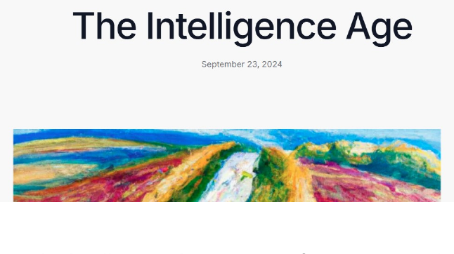{#fig-intelligence-age}

The Intelligence Age is a transformative era where AI shifts from being a basic
tool to foundational societal infrastructure (Sam Altman).

# Representation learning: the core ML principle

## The feature engineering problem

**Traditional Actuarial Approach:**

- Manual variable selection

- Domain expertise required

- Interactions specified manually

- Time-consuming process

**Example:** Motor insurance pricing:

- Must decide: include Age and Age$^2$? Age $\times$ Region? Etc.

- Hundreds of possible interactions

**The Curse of Dimensionality:**

- Increasing feature sets

- Telematics data: 1000s of variables

- High-frequency data

- Text data: unstructured

- Images: pixel-level data

- Time series: temporal dependencies

$\Longrightarrow$ *Manual feature engineering becomes infeasible!*

## Representation learning: automated feature construction

- **Problem:** Learn data transformations that make it easier to extract useful
  information for predictive modeling

- **Key idea:** Let the model discover the features

- **Traditional examples:** Principal component analysis (PCA) and partial least
  squares (PLS) method

- **Deep learning approach:** Hierarchical feature learning (layer by layer)

## Fashion-MNIST example: dataset overview

- Fashion-MNIST dataset contains 70,000 grayscale images (28x28 pixels) of
  clothing items. MNIST stands for Modified National Institute of Standards and
  Technology.

- Task: Classify the type of clothing.

- Ideal for comparing representation learning approaches.

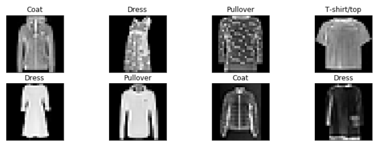{#fig-fashion-mnist}

## Fashion-MNIST example: traditional PCA results

- Direct PCA does not show much differentiation between classes.

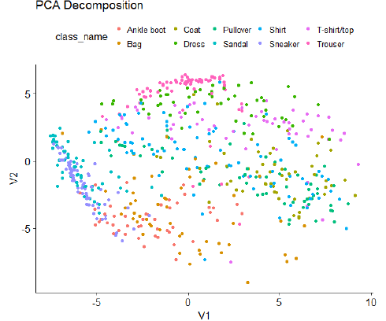{#fig-mnist-pca}

- Often, linear methods fail to capture the patterns in image data.

- Manual feature engineering would be required to improve performance.

## Representation learning

- **Representation Learning** is an ML technique where algorithms automatically
  design features that are optimal for a particular task.

- The feature space then comprises the learned features which can be fed into a
  DL model.

- BUT: Simple representation learning approaches often fail when applied to high
  dimensional data.

**Representation learning at a glance:** Given inputs
$\boldsymbol{X} \in \mathbb{R}^q$ and a response $Y$, learn a mapping
$\phi : \mathbb{R}^q \to \mathbb{R}^p$ with $p \ll q$ so that simple predictors
on $\boldsymbol{Z} = \phi(\boldsymbol{X})$ perform well (Bengio, Courville, &
Vincent, 2013).

## Deep learning

- **Deep Learning** is a representation learning technique that automatically
  constructs hierarchies of complex features (layer by layer) to represent
  abstract concepts.

- Features in higher layers (closer to outputs) are composed of simpler features
  from lower layers (closer to inputs).

- A typical example is a feed-forward neural network (FNN).

- **The principle:** Provide raw data to the DL architecture and let it figure
  out what and how to learn (by a suitable training algorithm).

## Fashion-MNIST example: deep learning solution

- Apply a deep autoencoder (a type of non-linear PCA) to the same data.

- Differences between some types of clothing are now much more clearly
  emphasized.

- The deep representation automatically captures meaningful differences between
  the images without much human input.

- This is an example of automated feature engineering.

- In contrast to the PCA, it considers non-linear transformations of the inputs.

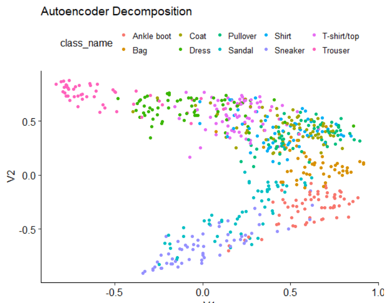{#fig-mnist-autoencoder}

## From representation to prediction

- **Step 1:** Deep sequential layers learn representations

- **Step 2:** Final layer performs prediction using the learned features

- **Key insight:** Deep network $=$ Feature extractor $+$ Predictor

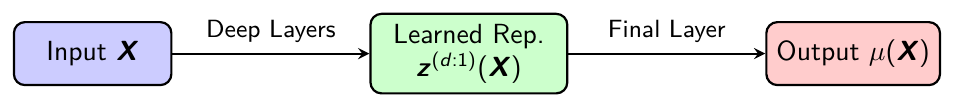{#fig-rep-to-pred}

- **Paradigm:** Deep network $=$ Encoder $+$ Decoder modules

## Why depth is important

- Depth in neural networks refers to the number of sequential layers, allowing
  for hierarchical feature construction.

- Shallow networks only allow for modeling (simple) direct relationships between
  inputs and outputs. Approximating more complex ones requires very wide shallow
  networks.

- Deeper layers build upon lower-level features: early layers detect basic
  patterns (e.g., edges in images), while deeper layers combine them into
  complex abstractions (e.g., objects or concepts).

- This hierarchy enables the network to capture intricate, non-linear
  interactions and dependencies in data that would require exponentially more
  parameters in a shallow model. Intuitively, this is similar to approximating a
  diagonal line by a step function.

- Theoretical support: Deep networks can approximate complex functions more
  efficiently than shallow ones (universal approximation theorem extensions).

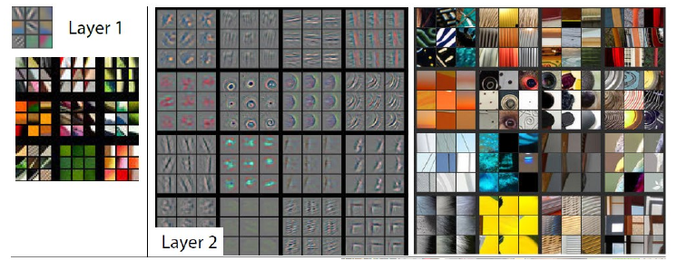{#fig-cnn-layers-12}

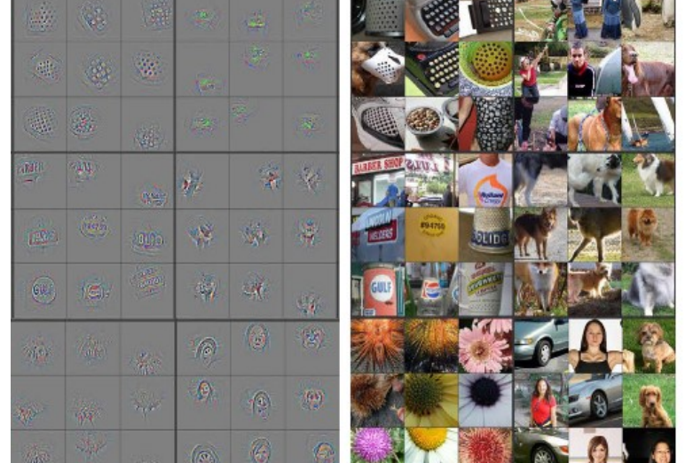{#fig-cnn-layer-5}

# Feed-forward neural networks

## Single layer FNN $=$ GLM

- **Single layer network**

- Circles $=$ input/output variables

- Lines $=$ connections (left to right)

- The input layer holds the input variables (covariates)...

- ...which are multiplied by weights (coefficients) to get the result
  (output/prediction). This may involve an additional link (activation)
  function.

- A single layer neural network is a generalized linear model (GLM)!

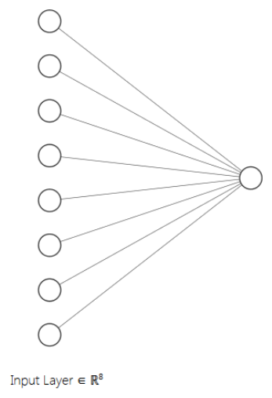{#fig-single-layer}

## Deep feed-forward neural network

- **Deep** $=$ multiple sequential layers

- **Feed-forward** $=$ data/signals travel from left to right

- More complicated (hierarchical) representations of the input data are learned
  in the hidden layers.

- This involves non-linear activations in each neuron.

- The weights are trained to extract the relevant information for the predictive
  problem at hand.

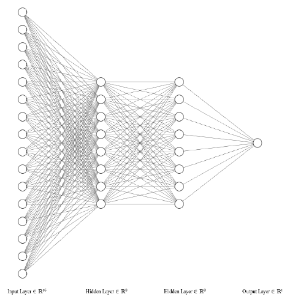{#fig-deep-fnn}

## FNN generalizes GLM

- Intermediate layers perform representation learning.

- The last layer is a (generalized) linear model, with input variables being the
  new representation of the data.

- One can strip off the last layer and use the learned features in other models,
  like XGBoost.

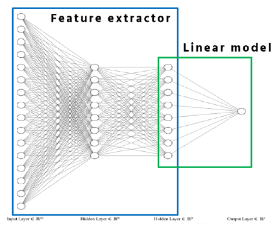{#fig-fnn-glm}

## Mathematical formulation, in brief

**Notation:**

- Input variable: $\boldsymbol{X} \in \mathbb{R}^{q_0}$

- Depth: $d \in \mathbb{N}$

- Hidden layers: $m = 1, \ldots, d$ with $q_m$ neurons each

- Hidden layer $m$ transformation:
  $\boldsymbol{z}^{(m)} : \mathbb{R}^{q_{m-1}} \to \mathbb{R}^{q_m}$

- Composition of hidden layers:
  $\boldsymbol{z}^{(d:1)} = \boldsymbol{z}^{(d)} \circ \cdots \circ \boldsymbol{z}^{(1)}$

**FNN regression function:**
$$\boldsymbol{X} ~\mapsto~ \mu_\vartheta(\boldsymbol{X}) = g^{-1} \left( w^{(d+1)}_0 + \langle \boldsymbol{w}^{(d+1)}, \boldsymbol{z}^{(d:1)}(\boldsymbol{X}) \rangle \right),$$
with inverse link $g^{-1}$ and where $\vartheta$ contains all network
parameters.

## Pre- and post-activation in FNNs

- **Pre-activation:** In each layer of a FNN, the inputs are multiplied by the
  layer's weights and added to biases (linear regression)
  $$\boldsymbol{w}^{(m)}_0 + W^{(m)} \boldsymbol{x} \in \mathbb{R}^{q_m},$$
  where $\boldsymbol{x} \in \mathbb{R}^{q_{m-1}}$ is the input,
  $W^{(m)} \in \mathbb{R}^{q_m \times q_{m-1}}$ are the weights, and
  $\boldsymbol{w}^{(m)}_0 \in \mathbb{R}^{q_m}$ is the bias parameter of the
  $m$-th layer.

- **Post-activation:** Select a non-linear activation function $\phi$
  $$\boldsymbol{x} ~\mapsto~ \boldsymbol{z}^{(m)}(\boldsymbol{x}) = \phi \left( \boldsymbol{w}^{(m)}_0 + W^{(m)} \boldsymbol{x} \right) \in \mathbb{R}^{q_m},$$
  this is understood component-wise $\Longrightarrow$ each neuron is a GLM.

- The activation introduces non-linearity, enabling the network to model complex
  patterns. Without it, the network would behave like a single linear model
  regardless of depth.

# Advanced architectures: a deep dive

## From vectors to tensors

**Traditional tabular data:** Inputs $\boldsymbol{X} \in \mathbb{R}^q$ are
vectors (1D tensor)

**Extended tensor structures (time-causal/spatial structure):**

- Time series data: $\boldsymbol{X}_{1:t} \in \mathbb{R}^{t \times q}$ (2D
  tensor)

- Images: $\boldsymbol{X}_{1:t, 1:s} \in \mathbb{R}^{t \times s \times 3}$ (3D
  tensor with three color channels RGB)

- [Panel data: Multiple instances over time]

**Key challenge:** How to design architectures that respect such structure?

- FNNs: Ignore temporal/spatial structure

- CNNs: Exploit local patterns via convolutions (1D or 2D CNNs)

- RNNs: Capture sequential/temporal dependencies

## Convolutional neural networks: a motivation

**Problem with FNNs for spatial/temporal data:**

- Full connectivity: Every input connects to every neuron

- Parameter explosion: Image $100 \times 100 \times 3 \to 30{,}000$ inputs!

- No spatial awareness: Adjacent pixels are treated independently

**CNN solution** (LeCun et al., 1998):

- **Local connectivity:** Neurons only connect to small regions (receptive
  fields), think of a window

- **Parameter sharing:** Same filter is applied across all positions, think of a
  rolling window (extracting local structure)

- **Hierarchical learning:** Low-level $\to$ High-level features

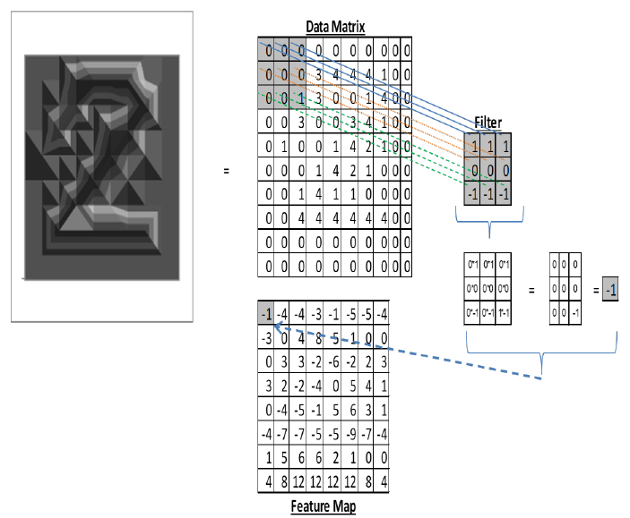{#fig-cnn-convolution}

## 1D CNN: mathematical formulation

**Input:** Sequential data $\boldsymbol{X}_{1:t} \in \mathbb{R}^{t \times q}$

**1D CNN layer with $q_1$ filters (window parameter sets):**
$$\boldsymbol{z}^{(1)} : \mathbb{R}^{t \times q} \to \mathbb{R}^{t' \times q_1}$$
where $t' = \lfloor t - K + 1 \rfloor$, the number of "convolutions" from the
rolling window.

**Finite range convolution** (we could use the $*$-symbol):
$$z^{(1)}_{u,j} = \phi \left( w^{(1)}_{0,j} + \sum_{k=1}^K \langle \boldsymbol{w}^{(1)}_{k,j}, \boldsymbol{X}_{u-1+k} \rangle \right),$$

- $K$: Kernel size (window size)

- $(\boldsymbol{w}^{(1)}_{k,j})_{k=1}^K \in \mathbb{R}^{K \times q}$: Filter
  weights of the $j$-th convolution, $1 \leq j \leq q_1$

## 1D CNN intuition and 2D CNN adaption

- Algebraically, the 1D CNN architecture has a very similar structure as a FNN,
  only the scalar product is replaced by a convolutional operation (that acts
  locally respecting sequential structure).

- 1D CNNs can be composed to a deep 1D CNN architecture.

- To reduce the dimension, often a deep 1D CNN architecture is followed by a
  pooling layer, which then constitutes the encoder/feature extractor.

- A subsequent GLM/FNN decoder maps to the output.

- There is the obvious 2D CNN extension by having a rolling window across two
  dimensions to process spatial data such as images.

## Recurrent neural networks: sequential memory

**Motivation:** Process sequences of variable length with memory (construction
of filtration that models the relevant information process)

**Recurrent update at time $u$:**
$$z^{(1)}_{u,j} = \phi \left( w^{(1)}_{0,j} + \langle \boldsymbol{w}^{(1)}_j, \boldsymbol{X}_u \rangle + \langle \boldsymbol{v}^{(1)}_j, \boldsymbol{z}^{(1)}_{u-1} \rangle \right) \qquad \text{for } 1 \leq j \leq q_1,$$

- $\boldsymbol{X}_u \in \mathbb{R}^q$: Current input at time $u$

- $\boldsymbol{z}^{(1)}_{u-1} \in \mathbb{R}^{q_1}$: Previous hidden state
  (memory) from times $\leq u-1$

- Parameters: $q_1(1 + q + q_1)$ (shared across time)

**Key insight:** Same as FNN but with recurrent connection
$\boldsymbol{z}^{(1)}_{u-1} \mapsto \boldsymbol{z}^{(1)}_u$

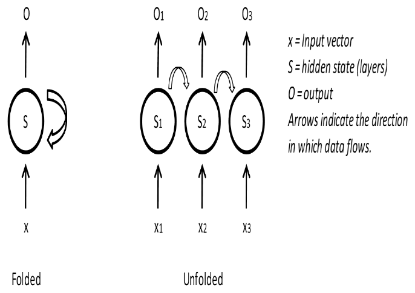{#fig-rnn}

## LSTM architecture diagram

LSTM architecture is a specialized RNN that allows for long-range dependence by
using different "gates" (Hochreiter & Schmidhuber, 1997).

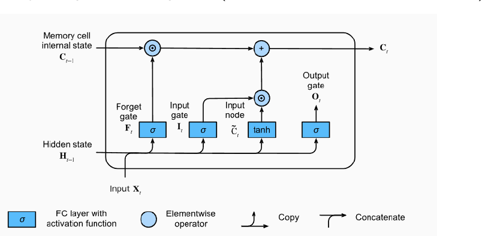{#fig-lstm}

## GRU architecture diagram

GRU is a simplified LSTM alternative that uses less gates and parameters (Cho,
van Merriënboer, Bahdanau, & Bengio, 2014).

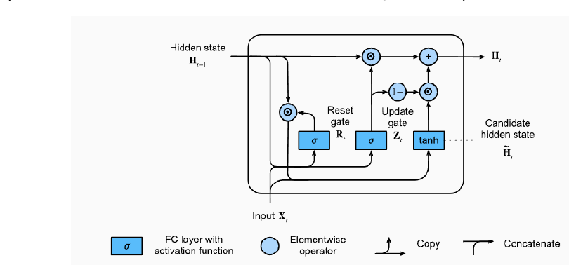{#fig-gru}

## CNN vs. RNN: when to use which?

**Use CNNs when:**

- Local patterns matter

- Translation invariance needed

- Spatial/grid structure exists

- Parallel processing required

**Examples:** Telematics data heatmaps; Geographic risk maps; Fixed-size
triangles

**Use RNNs when:**

- Sequential order crucial

- Variable lengths common (non-time-distributed output)

- Long-term dependencies

- Temporal causality important

**Examples:** Policy history modeling; Text processing (claims); Time series
forecasting

*Hybrid approaches: CNN for feature extraction $\to$ RNN for sequences*

## Embedding layer, categorical covariates

- One-hot encoding expresses the prior that categories are orthogonal.

- The traditional actuarial solution is Bühlmann credibility.

- **Embedding layer idea:** Related categories should cluster together.

    - It learns a dense vector transformation of sparse input vectors and
      clusters similar categories.

    - Can be regularized by variational inference to receive credible embeddings
      (Richman & Wüthrich, 2024), especially for high-cardinality categorical
      covariates, e.g., car models or job profiles

## Autoencoder, unsupervised learning

- An autoencoder is a network trained to produce an output similar to its input.

- A "bottleneck" in the middle restricts the dimension of the encoded data.

- It performs a type of non-linear PCA (without orthonormality constraints).

- The bottleneck layer expresses the prior that the data can be summarized in
  only a few dimensions (low-dimensional manifold).

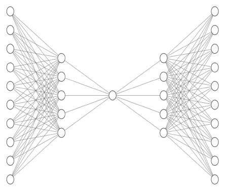{#fig-autoencoder}

## Transformers and attention, Vaswani et al. (2017)

**Key idea:** Attention mechanism, giving "contextualized embeddings"

**Self-attention formula:**
$$\mathrm{Attention}(Q, K, V) = \mathrm{softmax}\left( \frac{QK^\top}{\sqrt{d}} \right) V,$$
where $Q$, $K$, $V$ are query, key, value matrices (to communicate with
surrounding).

**Advantages:**

- Parallel processing (unlike RNNs) $=$ efficient computation on GPUs

- Long-range dependencies

- Somewhat interpretable attention weights

$\Longrightarrow$ *Full coverage in dedicated Transformer lecture*

## LocalGLMnet: interpretability focus

**Key idea:** Locally linear models

**Architecture** (Richman & Wüthrich, 2023):

- Neural network learns coefficients of local GLMs

- Each combination of covariates receives its own GLM (parameter)

- Predicions made as sum over $w_j(\boldsymbol{X}) X_j$

**Benefits:**

- Interpretability for predictions

- Captures heterogeneity

- More regulatory compliance friendly than FNNs

$\Longrightarrow$ *Detailed treatment in LocalGLMnet lecture*

# Combined actuarial neural network (CANN)

## CANN: bridging classical and modern modeling

**Motivation:**

- GLMs are interpretable but may miss complex patterns

- Deep networks are powerful but less interpretable

- Can we combine the two worlds?

**CANN Architecture** (Wüthrich & Merz, 2019):
$$\mu^{\rm CANN}(\boldsymbol{X}) = g^{-1} \left( \underbrace{\langle \widehat{\vartheta}^{\,\rm MLE}, \boldsymbol{X} \rangle}_{\text{GLM baseline}} + \underbrace{\langle \boldsymbol{w}^{(d+1)}, \boldsymbol{z}^{(d:1)}(\boldsymbol{X}) \rangle}_{\text{Network correction}} \right).$$

## CANN: implementation details

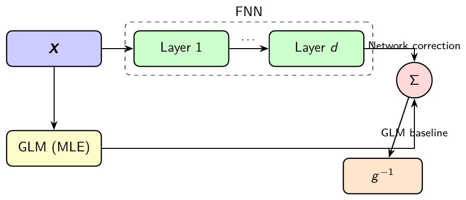{#fig-cann}

**2-step training procedure:**

1. Fit GLM using MLE, and freeze parameters $\widehat{\vartheta}^{\,\rm MLE}$

2. Train FNN to learn residual patterns (corrections to GLM predictions)

## CANN: advantages

- **Interpretability:** GLM component provides baseline understanding

- **Performance:** FNN captures non-linear patterns and interactions

- **Stability:** GLM ensures reasonable predictions even if FNN fails

- **Diagnostic:** FNN contribution shows where GLM is insufficient

**Connection to ResNet** (He et al., 2016):

- First term: residual/skip connection (input $\boldsymbol{X}$ maps directly to
  output)

- Second term: classic FNN architecture for non-linear corrections

- Interpretation: Linear GLM term $+$ non-linear FNN for interactions not
  captured by GLM

# Conclusion

## Key takeaways

- **Core principle:** Representation learning automates feature engineering

- **Mathematical foundation:** FNNs generalize GLMs through composition of
  non-linear functions consisting of (GLM) neurons

- **Advanced architectures:** CNNs, RNNs, Transformers for specific data types
  (temporal and spatial data)

- **Practical approach:** CANN and LocalGLMnet bridge traditional and modern
  methods being attractive for actuarial modeling

# Copyright {.unnumbered}

- © The Authors

- This notebook and these slides are part of the project "AI Tools for
  Actuaries". The lecture notes can be downloaded from:

<https://papers.ssrn.com/sol3/papers.cfm?abstract_id=5162304>

$\,$

- This material is provided to reusers to distribute, remix, adapt, and build
  upon the material in any medium or format for noncommercial purposes only, and
  only so long as attribution and credit is given to the original authors and
  source, and if you indicate if changes were made. This aligns with the
  Creative Commons Attribution 4.0 International License CC BY-NC.

# References {.unnumbered}

::: {#refs .references .csl-bib-body}
::: {.csl-entry}
Bengio, Y., Courville, A., & Vincent, P. (2013). Representation learning: A
review and new perspectives. *IEEE Transactions on Pattern Analysis and Machine
Intelligence*, *35*(8), 1798–1828.
:::

::: {.csl-entry}
Bommasani, R., Hudson, D. A., Adeli, E., Altman, R., Arora, S., von Arx, S., ...
others (2021). On the opportunities and risks of foundation models. *arXiv
preprint arXiv:2108.07258*.
:::

::: {.csl-entry}
Brown, T., Mann, B., Ryder, N., Subbiah, M., Kaplan, J. D., Dhariwal, P., ...
others (2020). Language models are few-shot learners. *Advances in Neural
Information Processing Systems*, *33*, 1877–1901.
:::

::: {.csl-entry}
Cho, K., van Merriënboer, B., Bahdanau, D., & Bengio, Y. (2014). Learning phrase
representations using rnn encoder-decoder for statistical machine translation.
*arXiv preprint arXiv:1406.1078*.
:::

::: {.csl-entry}
Cybenko, G. (1989). Approximation by superpositions of a sigmoidal function.
*Mathematics of Control, Signals and Systems*, *2*(4), 303–314.
:::

::: {.csl-entry}
Devlin, J., Chang, M.-W., Lee, K., & Toutanova, K. (2018). Bert: Pre-training of
deep bidirectional transformers for language understanding. *arXiv preprint
arXiv:1810.04805*.
:::

::: {.csl-entry}
He, K., Zhang, X., Ren, S., & Sun, J. (2016). Deep residual learning for image
recognition. In *Proceedings of the IEEE Conference on Computer Vision and
Pattern Recognition* (pp. 770–778).
:::

::: {.csl-entry}
Hinton, G. E., Osindero, S., & Teh, Y.-W. (2006). A fast learning algorithm for
deep belief nets. *Neural Computation*, *18*(7), 1527–1554.
:::

::: {.csl-entry}
Hochreiter, S., & Schmidhuber, J. (1997). Long short-term memory. *Neural
Computation*, *9*(8), 1735–1780.
:::

::: {.csl-entry}
Hoffmann, J., Borgeaud, S., Mensch, A., Buchatskaya, E., Cai, T., Rutherford,
E., ... others (2022). Training compute-optimal large language models. *arXiv
preprint arXiv:2203.15556*.
:::

::: {.csl-entry}
Hornik, K. (1991). Approximation capabilities of multilayer feedforward
networks. *Neural Networks*, *4*(2), 251–257.
:::

::: {.csl-entry}
Kaplan, J., McCandlish, S., Henighan, T., Brown, T. B., Chess, B., Child, R.,
... Amodei, D. (2020). Scaling laws for neural language models. *arXiv preprint
arXiv:2001.08361*.
:::

::: {.csl-entry}
Kojima, T., Gu, S. S., Reid, M., Matsuo, Y., & Iwasawa, Y. (2022). Large
language models are zero-shot reasoners. *Advances in Neural Information
Processing Systems*, *35*, 22199–22213.
:::

::: {.csl-entry}
Krizhevsky, A., Sutskever, I., & Hinton, G. E. (2012). Imagenet classification
with deep convolutional neural networks. *Advances in Neural Information
Processing Systems*, *25*, 1097–1105.
:::

::: {.csl-entry}
LeCun, Y., Bottou, L., Bengio, Y., & Haffner, P. (1998). Gradient-based learning
applied to document recognition. *Proceedings of the IEEE*, *86*(11), 2278–2324.
:::

::: {.csl-entry}
McCulloch, W. S., & Pitts, W. (1943). A logical calculus of the ideas immanent
in nervous activity. *The Bulletin of Mathematical Biophysics*, *5*(4), 115–133.
:::

::: {.csl-entry}
Minsky, M., & Papert, S. (1969). *Perceptrons: An introduction to computational
geometry*. MIT Press.
:::

::: {.csl-entry}
Ouyang, L., Wu, J., Jiang, X., Almeida, D., Wainwright, C., Mishkin, P., ...
others (2022). Training language models to follow instructions with human
feedback. *Advances in Neural Information Processing Systems*, *35*,
27730–27744.
:::

::: {.csl-entry}
Richman, R., & Wüthrich, M. V. (2023). LocalGLMnet: interpretable deep learning
for tabular data. *Scandinavian Actuarial Journal*, *2023*(1), 71–95.
:::

::: {.csl-entry}
Richman, R., & Wüthrich, M. V. (2024). High-cardinality categorical covariates
in network regressions. *Japanese Journal of Statistics and Data Science*,
*7*(2), 921–965.
:::

::: {.csl-entry}
Rosenblatt, F. (1958). The perceptron: a probabilistic model for information
storage and organization in the brain. *Psychological Review*, *65*(6), 386.
:::

::: {.csl-entry}
Rumelhart, D. E., Hinton, G. E., & Williams, R. J. (1986). Learning
representations by back-propagating errors. *Nature*, *323*(6088), 533–536.
:::

::: {.csl-entry}
Sutskever, I., Vinyals, O., & Le, Q. V. (2014). Sequence to sequence learning
with neural networks. *Advances in Neural Information Processing Systems*, *27*.
:::

::: {.csl-entry}
Vaswani, A., Shazeer, N., Parmar, N., Uszkoreit, J., Jones, L., Gomez, A. N.,
... Polosukhin, I. (2017). Attention is all you need. *Advances in Neural
Information Processing Systems*, *30*.
:::

::: {.csl-entry}
Wang, X., Wei, J., Schuurmans, D., Le, Q., Chi, E., Sharan, N., ... Zhou, D.
(2022). Self-consistency improves chain of thought reasoning in language models.
*arXiv preprint arXiv:2203.11171*.
:::

::: {.csl-entry}
Wei, J., Wang, X., Schuurmans, D., Bosma, M., Xia, F., Chi, E., ... others
(2022). Chain-of-thought prompting elicits reasoning in large language models.
*Advances in Neural Information Processing Systems*, *35*, 24824–24837.
:::

::: {.csl-entry}
Wüthrich, M. V., & Merz, M. (2019). Editorial: Yes, we CANN! *ASTIN Bulletin -
The Journal of the IAA*, *49*(1), 1–3.
:::

::: {.csl-entry}
Zeiler, M. D., & Fergus, R. (2014). Visualizing and understanding convolutional
networks. In *Computer Vision – ECCV 2014* (pp. 818–833). Springer.
:::

::: {.csl-entry}
Zhang, A., Lipton, Z. C., Li, M., & Smola, A. J. (2023). *Dive into deep
learning*. Cambridge University Press.
:::
:::
