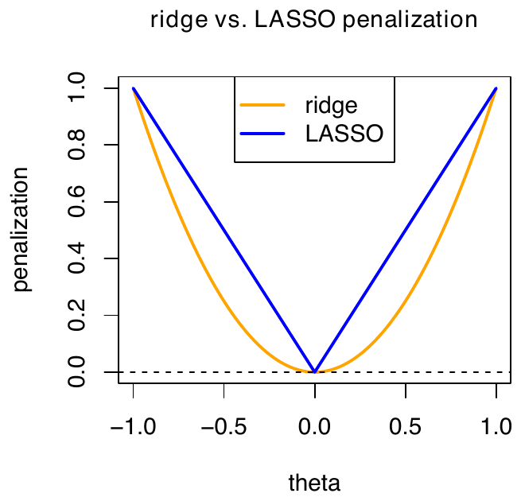
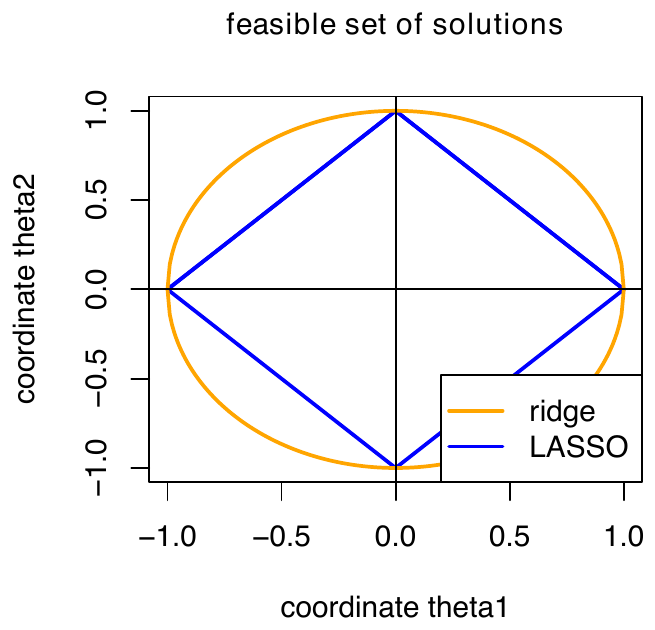
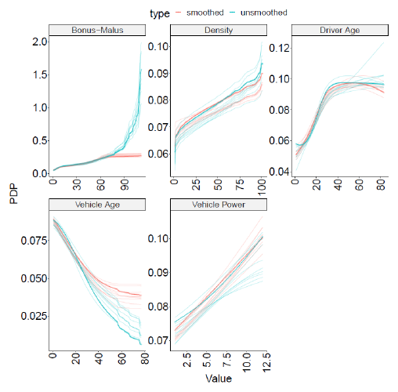
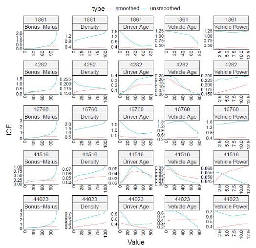
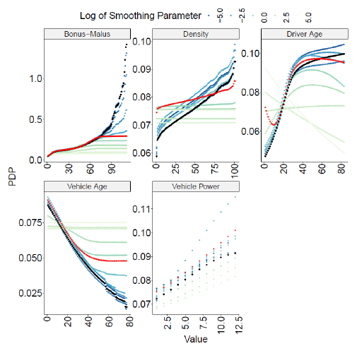

---
# RECONSTRUCTION, not a file issued by the course authors.
#
# Lectures 3, 8 and 12 were handed out as beamer PDFs only, so this document
# transcribes the deck frame by frame into the same Quarto shell the other
# lecture pages use. The text, the mathematics and the tables are the authors'.
# What is ours: the abstract below (joined from the deck's own Overview boxes),
# the section ordering into a document rather than slides, and the figures,
# which are cropped out of the slide pages by
# scripts/extract_lecture_figures.py.
#
# Render with scripts/render_lecture.sh, not bare `quarto render`. The script
# strips Quarto's Bootstrap and JS assets so the page has the same effective
# structure as the authors' pages, which is what lecture.css lays out.
title: "Lecture 8: ICEnet and Regularization"
subtitle: |
  | Deep Learning for Actuarial Modeling
  | Summer School 'Lifelong Learning'
  | Università Cattolica del Sacro Cuore, Milano
author: "Ronald Richman, Salvatore Scognamiglio, Mario V. Wüthrich, Marco Maggi"
date: "2026-07-21"
abstract: >
  Regularization is a model fitting technique that aims at variable shrinkage and
  variable selection during their estimation procedure. This can be achieved by
  penalizing extreme parameter values, making models generally more smooth (in
  some sense). This lecture discusses different regularization methods, and then
  presents the ICEnet architecture of Richman and Wüthrich (2024), which
  constrains neural-network predictions so that they are smooth and monotone with
  respect to selected risk factors, while keeping the deep-learning framework.
format:
  html:
    toc: true
    toc-depth: 3
    number-sections: true
    css: lecture.css
    embed-resources: false
---

# Regularization

::: {.callout-note icon=false title="Overview"}
Regularization is a model fitting technique that aims at variable shrinkage and
variable selection during their estimation procedure. This can be achieved by
penalizing extreme parameter values, making models generally more smooth (in
some sense). This section discusses different regularization methods.
:::

## Regularization: introduction

- Generally speaking, a regression model $\boldsymbol{X} \mapsto \mu(\boldsymbol{X})$
  is correctly specified if it integrates all relevant covariates in the correct
  form, and if there is no redundant, missing or wrong covariate in the
  regression function:

    - *redundant* means that we include multiple covariates that essentially
      present the same information (e.g., being collinear);

    - *missing* means that we have forgotten important covariate information
      that would be available; and

    - *wrong* means that the covariate does not impact the response.

- In real world problems, with unknown regression functions, this is part of
  covariate pre-processing, model selection and covariate selection.

- One might be tempted to include any available information into the regression
  model, to ensure that nothing gets forgotten. However, fitting on finite
  samples, this is usually not a good strategy, because one may easily run into
  over-fitting issues, difficulties with collinearity in covariates, in
  identifiability issues, and, generally, in a poor predictive model because
  model fitting has not been successful.

- Model complexity control is crucial in a successful model fitting and
  predictive modeling procedure. Typically, one aims for a *sparse* model,
  meaning that one aims for *parsimony* having the fewest necessary variables
  but still providing accurate predictions.

- In practice, neither knowing the true model nor the (causal) regression
  structure and the factors that impact the responses, one often starts with
  slightly too large models, that one tries to shrink by regularization.
  Regularization penalizes model complexity and/or extreme regression
  coefficients.

## Regularization techniques

We describe the most popular regularization techniques in this section; see
Hastie, Tibshirani and Wainwright (2015).

- *Ridge regularization* (also known as Tikhonov (1943) regularization or
  $L^2$-regularization);

- *LASSO regularization* of Tibshirani (1996) ($L^1$-regularization);

- *Elastic net regularization* of Zou and Hastie (2005);

- *Fused LASSO regularization* of Tibshirani *et al.* (2005);

- *Group LASSO regularization* of Yuan and Lin (2006);

- *Smoothly clipped absolute deviation (SCAD) regularization* of Fan and Li
  (2001); we skip the details of SCAD in this notebook.

## Regularization preparation

- Consider a parametric regression estimation $\mu_{\widehat{\vartheta}}(\cdot)$
  by selecting from a class of candidate models
  $\mathcal{M} = \{\mu_\vartheta\}_\vartheta$ being parametrized by $\vartheta$.

- The parameter $\vartheta$ is assumed to be a $(r+1)$-dimensional vector
  $$\vartheta = (\vartheta_0, \vartheta_1, \ldots, \vartheta_r)^\top \in \mathbb{R}^{r+1}.$$
  Typically, $(\vartheta_k)_{k=1}^r$ parametrizes the terms in
  $\mu_\vartheta(\boldsymbol{X})$ involving the covariates $\boldsymbol{X}$, and
  $\vartheta_0$ is a parameter for the covariate-free part of the regression
  function determining the overall level of the regression function;
  $\vartheta_0$ is the *intercept/bias term*, see GLM above.

- This bias term $\vartheta_0$ needs to be excluded from regularization to be
  able to calibrate the overall level of the model.

- Denote by
  $\vartheta_{\backslash 0} = (\vartheta_1, \ldots, \vartheta_r)^\top \in \mathbb{R}^r$
  the parameter vector excluding the bias term $\vartheta_0$.

## Regularization: penalty function

- Regularized parameter estimation is achieved by
  $$\widehat{\vartheta} ~\in~ \arg\min_\vartheta \left( \sum_{i=1}^n \frac{v_i}{\varphi}\, L(Y_i, \mu_\vartheta(\boldsymbol{X}_i)) + \lambda\, R(\vartheta_{\backslash 0}) \right),$$
  where $R : \mathbb{R}^r \to \mathbb{R}_+$ is a *penalty function* and
  $\lambda \geq 0$ is the *regularization parameter*.

- We give the most common examples of penalty functions, below.

- Noteworthy, we do not consider any scaling $1/n$ in front of the sum. This
  scaling does not affect the optimal solution in the non-regularized case, but
  it makes the regularization parameter $\lambda$ sample size independent.

## Ridge regularization/regression

- Ridge regression selects a squared $L^2$-norm penalty function for $R$
  $$\widehat{\vartheta}^{\,\rm ridge} ~\in~ \arg\min_\vartheta \left( \sum_{i=1}^n \frac{v_i}{\varphi}\, L(Y_i, \mu_\vartheta(\boldsymbol{X}_i)) + \lambda\, \|\vartheta_{\backslash 0}\|_2^2 \right).$$

- Ridge regularization generally punishes large values in
  $(\vartheta_k)_{k=1}^r$, this is called *shrinkage*.

- The level of shrinkage is determined by the regularization parameter
  $\lambda \geq 0$, and an optimal choice is determined, e.g., by
  cross-validation.

- This intuition of shrinkage indicates why we exclude the bias term
  $\vartheta_0$ from regularization. Otherwise, we receive a statistically
  biased model.

## LASSO regularization/regression

- LASSO regularization (least absolute shrinkage and selection operator
  regularization) selects an $L^1$-norm penalty function for $R$
  $$\widehat{\vartheta}^{\,\rm LASSO} ~\in~ \arg\min_\vartheta \left( \sum_{i=1}^n \frac{v_i}{\varphi}\, L(Y_i, \mu_\vartheta(\boldsymbol{X}_i)) + \lambda\, \|\vartheta_{\backslash 0}\|_1 \right).$$

- The behavior of LASSO regularization is fundamentally different from ridge
  regularization. This difference results from the fact that the $L^2$-norm is
  differentiable in the origin and the $L^1$-norm is not.

{#fig-ridge-lasso}

- The consequence of this degeneracy of the $L^1$-norm in the origin is that
  some of the components of $(\vartheta_k)_{k=1}^r$ may be optimal in LASSO
  regularization if they are *exactly* equal to zero.

- The more we increase the regularization parameter $\lambda \uparrow \infty$,
  the more components of $(\vartheta_k)_{k=1}^r$ are optimal in precisely
  setting them to zero.

- Increasing the regularization parameter $\lambda$ leads to sparsity of
  non-zero values in $(\vartheta_k)_{k=1}^r$, and, consequently, there results a
  *sparse regression model* for large regularization parameters
  $\lambda \gg 0$.

- This can be interpreted as *variable importance*, i.e., for large $\lambda$
  only important covariate components survive.

- Often, one performs variable selection with LASSO regularization, and then one
  fits a non-regularized model on the selected components.

## Geometric interpretation of ridge vs. LASSO

- Generally, these regularized regression problems can be interpreted
  geometrically using the method of Lagrange:

    - the feasible set of solutions in the ridge regression case is a
      $L^2$-ball, and

    - in the LASSO regression case a $L^1$-cube;

  we refer to the next graph.

- This geometric difference (having corners or not) precisely distinguishes
  sparsity of LASSO from shrinkage of ridge regression, i.e., this is related to
  the difference of these convex geometric sets having differentiable boundaries
  or not.

- In fact, one considers orthogonal projections to the ball and cube,
  respectively, and sparsity in LASSO results from corner solutions in the cube
  case.

{#fig-feasible-set}

## Best-subset selection regularization

- *Best-subset selection regularization* selects a $L^0$-norm penalty function
  for $R$
  $$\widehat{\vartheta}^{\,\rm BSS} ~\in~ \arg\min_\vartheta \left( \sum_{i=1}^n \frac{v_i}{\varphi}\, L(Y_i, \mu_\vartheta(\boldsymbol{X}_i)) + \lambda \sum_{k=1}^r \mathbf{1}_{\{\vartheta_k \neq 0\}} \right).$$

- This version is not used very often in applications mainly because optimizing
  the above is difficult, in fact, LASSO regularization is considered as a
  tractable version instead.

## Elastic regularization

- *Elastic net regularization* combines LASSO and ridge regularization
  $$\widehat{\vartheta}^{\,\rm net} \in \arg\min_\vartheta \left( \sum_{i=1}^n \frac{v_i}{\varphi} L(Y_i, \mu_\vartheta(\boldsymbol{X}_i)) + \lambda \left( \alpha \|\vartheta_{\backslash 0}\|_1 + (1-\alpha) \|\vartheta_{\backslash 0}\|_2^2 \right) \right),$$
  with $\alpha \in [0,1]$.

- Elastic net regularization overcomes some issues of LASSO, e.g., LASSO has the
  tendency to group effects by assigning similar weights to correlated covariate
  components.

## Grouped covariates

- The previous regularization proposals have been focusing on shrinking the
  regression parameters $(\vartheta_k)_{k=1}^r$ and/or to make regression models
  sparse by setting some of these parameters $\vartheta_k$ exactly to zero.

- In these regularization methods all terms and parameters
  $(\vartheta_k)_{k=1}^r$ are considered individually.

- If we want to treat some of them jointly in a group, e.g., for a dummy coded
  categorical covariate, regularization should act simultaneously on all
  parameters that belong to that group.

- We group the (categorical) covariates. Assume we have $G$ groups
  $$\vartheta_{\backslash 0} = \left( \vartheta^{(1)}, \ldots, \vartheta^{(G)} \right)^\top \in \mathbb{R}^{d_1 + \cdots + d_G} = \mathbb{R}^r,$$
  where each group $\vartheta^{(k)} \in \mathbb{R}^{d_k}$ contains $d_k$
  components of $\vartheta_{\backslash 0}$.

## Group LASSO regularization

- *Group LASSO regularization* is obtained by solving
  $$\widehat{\vartheta} ~\in~ \arg\min_\vartheta \left( \sum_{i=1}^n \frac{v_i}{\varphi}\, L(Y_i, \mu_\vartheta(\boldsymbol{X}_i)) + \sum_{k=1}^G \lambda_k\, \|\vartheta^{(k)}\|_2 \right),$$
  for regularization parameters $\lambda_k \geq 0$.

- For increasing regularization parameters $\lambda_k$, group LASSO
  regularization leads to sparsity in setting the entire block of covariates
  $\vartheta^{(k)} \in \mathbb{R}^{d_k}$ simultaneously equal to zero.

## Fused LASSO regularization

- Assume there is an adjacency relation on the covariate components, i.e., the
  covariate component $X_j$ is naturally embedded between the components
  $X_{j-1}$ and $X_{j+1}$, and we try to achieve a certain smoothness of the
  regression parameters for these covariates.

- *Fused LASSO regularization* is obtained by solving
  $$\widehat{\vartheta} ~\in~ \arg\min_\vartheta \left( \sum_{i=1}^n \frac{v_i}{\varphi}\, L(Y_i, \mu_\vartheta(\boldsymbol{X}_i)) + \sum_{j=2}^r \lambda_j\, |\vartheta_j - \vartheta_{j-1}| \right),$$
  for regularization parameters $\lambda_j \geq 0$.

- The fused LASSO proposal enforces sparsity in the non-zero components, but
  also sparsity in the different regression parameter values for adjacent
  variables. It considers first order differences, and one could also consider
  second (or higher) order differences.

## Positivity and monotonicity regularization

- One may want to enforce that the parameters are positive
  $$\widehat{\vartheta} ~\in~ \arg\min_\vartheta \left( \sum_{i=1}^n \frac{v_i}{\varphi}\, L(Y_i, \mu_\vartheta(\boldsymbol{X}_i)) + \sum_{j=1}^r \lambda_j\, (0 - \vartheta_j)_+ \right).$$

- Enforcement of a monotone increasing property
  $$\widehat{\vartheta} ~\in~ \arg\min_\vartheta \left( \sum_{i=1}^n \frac{v_i}{\varphi}\, L(Y_i, \mu_\vartheta(\boldsymbol{X}_i)) + \sum_{j=1}^r \lambda_j\, (\vartheta_{j-1} - \vartheta_j)_+ \right),$$
  with *rectified linear unit (ReLU) function*
  $$u \mapsto (u)_+ = \max\{u, 0\} = u\, \mathbf{1}_{\{u > 0\}}.$$

- The above regularizes parameters $\vartheta_{\backslash 0}$, but one could
  also enforce smoothness and monotonicity in the regression function components
  (e.g., mortality graduation); see Richman and Wüthrich (2024).

# ICEnet: smoothness and monotonicity constraints for neural networks

::: {.callout-note icon=false title="Overview"}
This section presents the ICEnet architecture introduced by Richman and Wüthrich
(2024). The central idea is to constrain neural-network predictions so that they
are smooth and monotone with respect to selected risk factors, while keeping the
deep-learning framework.
:::

The contribution is directly connected to regularization: instead of penalizing
only the parameters, ICEnet penalizes the behavior of the predictive function on
*Individual Conditional Expectations* (ICE).

## Actuarial motivation

- In actuarial pricing, tariff curves are often expected to satisfy structural
  requirements:

    - *smoothness*, to prevent abrupt premium changes that are difficult to
      justify to policyholders;

    - *monotonicity*, when actuarial knowledge implies a clear direction of
      risk.

- In GLMs, these constraints can be imposed by directly modifying the model
  coefficients.

- In neural networks, operating directly on the model coefficients or
  architecture to impose these constraints is less feasible.

- ICEnet overcomes this limitation by imposing constraints on the model
  predictions, rather than on the network parameters themselves.

## ICE and PDP: interpretability ingredients

- Consider the fitted regression function
  $$\boldsymbol{X} = (X_1, \ldots, X_q)^\top ~\longmapsto~ \mu_{\widehat{\vartheta}}(\boldsymbol{X}),$$
  where $q$ is the number of covariates.

- For covariate $j$, define the set of values
  $$\mathcal{A}_j = \left\{ a^j_1, \ldots, a^j_{K_j} \right\}.$$

    - If $X_j$ is **categorical**, $\mathcal{A}_j$ contains all its $K_j$
      possible levels.

    - If $X_j$ is **continuous**, $\mathcal{A}_j$ contains $K_j$ representative
      values selected over its observed range, for example using quantile
      binning. These values are typically ordered as
      $a^j_1 < \cdots < a^j_{K_j}$.

- For each observation $i$, define the pseudo-input
  $$\widetilde{\boldsymbol{X}}^{[j]}_i(u) = \left( X_{i,1}, \ldots, X_{i,j-1}, a^j_u, X_{i,j+1}, \ldots, X_{i,q} \right)^\top, \qquad u = 1, \ldots, K_j.$$

- The ICE curve for observation $i$ and covariate $j$ is
  $$\mathrm{ICE}^{[j]}_i = \left[ \mu_{\widehat{\vartheta}}\left( \widetilde{\boldsymbol{X}}^{[j]}_i(1) \right), \ldots, \mu_{\widehat{\vartheta}}\left( \widetilde{\boldsymbol{X}}^{[j]}_i(K_j) \right) \right]^\top.$$

::: {.callout-note title="Note"}
The corresponding Partial Dependence Plot (PDP) is the empirical average of the
ICE curves:
$$\mathrm{PDP}^{[j]} = \frac{1}{n} \sum_{i=1}^n \mathrm{ICE}^{[j]}_i.$$
:::

## Key idea of ICEnet

- Select the covariates requiring smoothness $\mathcal{S} \subset \{1, \ldots, q\}$
  or monotonicity, $\mathcal{M} \subset \{1, \ldots, q\}$.

- For each observation $\boldsymbol{X}_i$, generate pseudo-inputs
  $\widetilde{\boldsymbol{X}}^{[j]}_i(u)$ by varying the constrained covariates.

- Apply the same model $\mu_{\widehat{\vartheta}}(\cdot)$ to:

    - observed inputs, to obtain $\widehat{Y}_i$;

    - pseudo-inputs, to obtain ICE curves.

- Fit the model using a compound loss:

  predictive loss $+$ smoothness penalty $+$ monotonicity penalty.

## Compound ICEnet loss

For each observation $i$, the ICEnet uses the compound loss
$$L(\vartheta; i) = L^D(Y_i, \mu_\vartheta(\boldsymbol{X}_i)) + L_2(\mu_\vartheta(\boldsymbol{X}_i)) + L_3(\mu_\vartheta(\boldsymbol{X}_i)),$$
where $L^D$ is the deviance loss associated with the considered regression
problem.

- $L_2(\mu_\vartheta(\boldsymbol{X}_i))$ penalizes violations of smoothness for
  the covariates in $\mathcal{S}$.

- $L_3(\mu_\vartheta(\boldsymbol{X}_i))$ penalizes violations of monotonicity for
  the covariates in $\mathcal{M}$.

- These penalty terms depend on non-negative regularization parameters
  $\lambda_{sj}$ and $\lambda_{mj}$, which control the trade-off between
  predictive accuracy and the strength of the imposed constraints.

## Smoothness penalty

- The ICEnet uses a Whittaker-Henderson type penalty to impose smoothness on the
  ICE outputs.

- The first-order difference is defined for $u = 2, \ldots, K_j$ as
  $$\Delta^1 \left( \mu_\vartheta \left( \widetilde{\boldsymbol{X}}^{[j]}_i(u) \right) \right) = \mu_\vartheta \left( \widetilde{\boldsymbol{X}}^{[j]}_i(u) \right) - \mu_\vartheta \left( \widetilde{\boldsymbol{X}}^{[j]}_i(u-1) \right).$$

- For $\tau \geq 2$, the $\tau$-th order difference is defined recursively for
  $u = \tau+1, \ldots, K_j$ as
  $$\Delta^\tau \left( \mu_\vartheta \left( \widetilde{\boldsymbol{X}}^{[j]}_i(u) \right) \right) = \Delta^{\tau-1} \left( \mu_\vartheta \left( \widetilde{\boldsymbol{X}}^{[j]}_i(u) \right) \right) - \Delta^{\tau-1} \left( \mu_\vartheta \left( \widetilde{\boldsymbol{X}}^{[j]}_i(u-1) \right) \right).$$

- The ICEnet penalizes squared third-order differences:
  $$L_2(\mu_\vartheta(\boldsymbol{X}_i)) = \sum_{j \in \mathcal{S}} \sum_{u=4}^{K_j} \lambda_{s,j} \left[ \Delta^3 \left( \mu_\vartheta \left( \widetilde{\boldsymbol{X}}^{[j]}_i(u) \right) \right) \right]^2.$$

## Monotonicity penalty

- Monotonicity is imposed by penalizing first differences with the undesired
  sign:
  $$L_3(\mu_\vartheta(\boldsymbol{X}_i)) = \sum_{j \in \mathcal{M}} \sum_{u=2}^{K_j} \lambda_{m,j} \max \left[ \delta_j \Delta^1 \left( \mu_\vartheta \left( \widetilde{\boldsymbol{X}}^{[j]}_i(u) \right) \right), 0 \right].$$

- $\delta_j = -1$ enforces a monotone increasing relationship.

- $\delta_j = +1$ enforces a monotone decreasing relationship.

- If the ICE curve follows the required direction, the penalty is zero.

# ICEnet example: French MTPL data

- Goal: predict claims frequency.

- Constrained variables:

| Covariate | Smoothness | Monotonicity | Direction |
|:---|---:|---:|---:|
| Driver age | 10 | 0 | - |
| Vehicle age | 1 | 0 | - |
| Bonus-malus | 1 | 100 | increasing |
| Density | 1 | 100 | increasing |
| Vehicle power | 1 | 100 | increasing |

- Setup: FCN with depth $d = 3$, layer dimensions $(32, 16, 8)$, ReLU
  activation, embedding layers for unordered categorical variables and Adam with
  early stopping.

## Main predictive results

| Model | Learn | Test |
|:---|---:|---:|
| FCN | 0.4500 (0.000399) | 0.4511 (0.000663) |
| FCN nagging | 0.4491 | 0.4504 |
| ICEnet | 0.4510 (0.000340) | 0.4513 (0.000446) |
| ICEnet nagging | 0.4506 | 0.4508 |

- Adding constraints worsens Poisson deviance only marginally.

- The learning-test gap is smaller for ICEnet: the constraints also act as a
  form of regularization.

## Partial dependence plot

{#fig-pdp}

## ICE plots

{#fig-ice}

## PDPs under different constraint-parameter values

{#fig-pdp-constraints}

# Copyright {.unnumbered}

- © The Authors

- This notebook and these slides are part of the project "AI Tools for
  Actuaries". The lecture notes can be downloaded from:

<https://papers.ssrn.com/sol3/papers.cfm?abstract_id=5162304>

$\,$

- This material is provided to reusers to distribute, remix, adapt, and build
  upon the material in any medium or format for noncommercial purposes only, and
  only so long as attribution and credit is given to the original authors and
  source, and if you indicate if changes were made. This aligns with the
  Creative Commons Attribution 4.0 International License CC BY-NC.

# References {.unnumbered}

::: {#refs .references .csl-bib-body}
::: {.csl-entry}
Fan, J. and Li, R. (2001) "Variable selection via nonconcave penalized
likelihood and its oracle properties," *Journal of the American Statistical
Association*, 96(456), pp. 1348–1360. Available at:
<https://doi.org/10.1198/016214501753382273>.
:::

::: {.csl-entry}
Hastie, T., Tibshirani, R. and Wainwright, M. (2015) *Statistical learning with
sparsity: The LASSO and generalizations*. Chapman & Hall/CRC. Available at:
<https://doi.org/10.1201/b18401>.
:::

::: {.csl-entry}
Richman, R. and Wüthrich, M.V. (2024) "Smoothness and monotonicity constraints
for neural networks using ICEnet," *Annals of Actuarial Science*, 18(3),
pp. 712–739. Available at:
<https://www.cambridge.org/core/product/465BBBA65B70D62FEE9CE838C6E88B58>.
:::

::: {.csl-entry}
Tibshirani, R. (1996) "Regression shrinkage and selection via the LASSO,"
*Journal of the Royal Statistical Society. Series B (Methodological)*, 58(1),
pp. 267–288. Available at: <http://www.jstor.org/stable/2346178>.
:::

::: {.csl-entry}
Tibshirani, R. *et al.* (2005) "Sparsity and smoothness via the fused LASSO,"
*Journal of the Royal Statistical Society Series B*, 67(1), pp. 91–108.
Available at: <https://doi.org/10.1111/j.1467-9868.2005.00490.x>.
:::

::: {.csl-entry}
Tikhonov, A.N. (1943) "On the stability of inverse problems," *Doklady Akademii
Nauk SSSR*, 39(5), pp. 195–198.
:::

::: {.csl-entry}
Yuan, M. and Lin, Y. (2006) "Model selection and estimation in regression with
grouped variables," *Journal of the Royal Statistical Society Series B*, 68(1),
pp. 49–67. Available at: <https://doi.org/10.1111/j.1467-9868.2005.00532.x>.
:::

::: {.csl-entry}
Zou, H. and Hastie, T. (2005) "Regularization and variable selection via the
elastic net," *Journal of the Royal Statistical Society Series B: Statistical
Methodology*, 67(2), pp. 301–320. Available at:
<https://doi.org/10.1111/j.1467-9868.2005.00503.x>.
:::
:::
