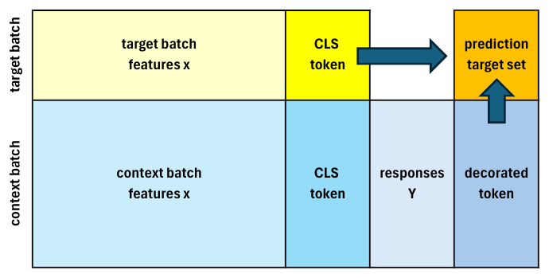
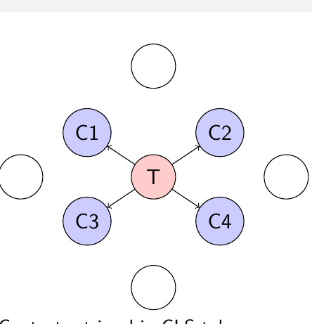
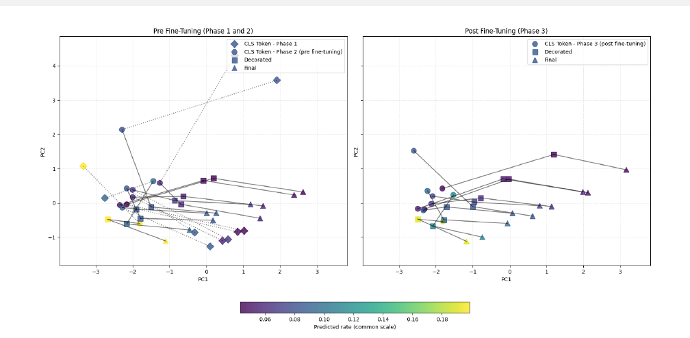
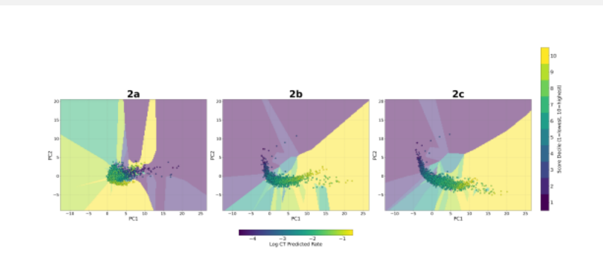

---
# RECONSTRUCTION, not a file issued by the course authors. See
# lectures/08_icenet-regularization.qmd for the full note on what is theirs and
# what is ours. Render with scripts/render_lecture.sh, not bare `quarto render`.
title: "Lecture 12: Foundation Models and In-Context Learning"
subtitle: |
  | Deep Learning for Actuarial Modeling
  | Summer School 'Lifelong Learning'
  | Università Cattolica del Sacro Cuore, Milano
author: "Salvatore Scognamiglio, Marco Maggi, Mario V. Wüthrich, Ronald Richman"
date: "2026-09-04"
abstract: >
  A foundation model is trained on a broad and diverse corpus of data that
  transfers across many downstream tasks and domains with minimal task-specific
  changes. This lecture traces the GPT series, then turns to tabular foundation
  models such as TabPFN and TabICL, and to the in-context learning credibility
  transformer (ICL-CT), which integrates Bühlmann credibility with the attention
  mechanism and generalises to unseen region categories with no retraining.
format:
  html:
    toc: true
    toc-depth: 3
    number-sections: true
    css: lecture.css
    embed-resources: false
---

# Foundation models

## What are foundation models?

- **Definition:** A Foundation Model is trained on broad and diverse corpus of
  data that transfer across many downstream tasks (and domains) with minimal
  task-specific changes

- **Core properties:** Scale (parameters, tokens), general representations, and
  versatile adaptation (prompting/in-context learning (ICL), retrieval augmented
  generation (RAG), fine-tuning)

- **Backbone:** Usually Transformers are used with auto-regressive (AR) data
  generation (Vaswani et al., 2017)

- **Scaling:** Capability follows a "compute-data-parameter" simultaneous power
  law growth (Kaplan, McCandlish, Henighan, Brown, et al., 2020; Hoffmann,
  Borgeaud, Mensch, et al., 2022) to get optimal models

## Architectural backbone: transformers

- Self-attention replaces recurrent and convolutional structure; parallelizable
  sequence modeling (Vaswani et al., 2017)

- Pre-training variants: masked language model (ML) (Devlin, Chang, Lee, &
  Toutanova, 2019) vs. auto-regressive decoders

- Inductive biases: weak relation input-output, gives great modeling flexibility
  through the self-attention mechanism (Geva et al., 2021)

- Positional encodings and other long-context tricks to adapt to sequential data
  (e.g., rotary position embedding (RoPE); Su, Lu, Pan, Wen, & Liu, 2021)

- Previously, we have mentioned scaling laws (Kaplan et al., 2020)

## Data needs for training foundation models

- **Scale:** Billions to trillions of tokens with a compute-optimal balance of
  parameters and tokens; budget tokens, not only parameters (Hoffmann et al.,
  2022)

- **Diversity:** Broad domains, style, language, and modality coverage (range,
  diversity and completeness) to learn general representations and handle
  distribution shift

- **Quality:** Rigorous filtering and de-duplication at document and paragraph
  level; near-duplicate removal; language identification (Italian/German/...);
  low-quality text removal; test-set decontamination

- **Long-tail coverage:** Upweight rare languages, domains, and entities; mix
  high-quality curated slices with broad web-scale data to raise
  signal-to-noise ratio

## Foundation models as a model class

- Input space $\mathcal{X}$ and output space $\mathcal{Y}$

- Model class:
  $$\mathcal{F} = \{ f_\theta : \mathcal{X} \to \mathcal{Y} ~|~ \theta \in \Theta \},$$
  with parameter set $\Theta \subset \mathbb{R}^r$, $r \gg 10^8$

- Probabilistic view, categorical case with $K$ classes
  $\mathcal{K} = \{1, \ldots, K\}$, the model
  $f_\theta(\boldsymbol{x}) \in \mathcal{Y} = \mathbb{R}^K$ parametrizes the
  probabilities of the next token
  $$p_\theta(Y = k \mid \boldsymbol{x}) = \frac{\exp\{f_{k,\theta}(\boldsymbol{x})\}}{\sum_{l=1}^K \exp\{f_{l,\theta}(\boldsymbol{x})\}} \qquad \text{for } k \in \mathcal{K};$$
  this applies the softmax to the components of
  $f_\theta(\boldsymbol{x}) = (f_{l,\theta}(\boldsymbol{x}))_{l=1}^K$

- This allows for next token simulation by AR generation

## Pre-training and adaptation

- By a slight abuse of notation, assume
  $\boldsymbol{x} = \boldsymbol{x}_{1:t} = (x_1, \ldots, x_t)$ is sequential data
  of tokens, and let the next token $Y = x_{t+1}$ be in the same token space

- Pre-training (auto-regressive MLE):
  $$\theta^\star_{\rm pre} \in \arg\max_{\theta \in \Theta} \sum_t \log p_\theta(Y = x_{t+1} \mid x_{1:t})$$
  calibrates broad priors

- Adaptation options: fine-tune, parameter-efficient fine-tuning (PEFT),
  low-rank adaptation (LoRA), in-context leaning (ICL) via demonstration
  examples, retrieval augmented generation (RAG)

- ICL: $f_{\theta^\star_{\rm pre}}([\mathcal{C}, \boldsymbol{x}])$ with prompt
  demonstration $\mathcal{C}$ (Brown et al., 2020)

# Generative pre-trained transformer (GPT) series advances

## From GPT-1 to GPT-5

- GPT-1/2: Unsupervised pre-training improves transfer; scaling unlocks fluent
  generation (Radford, Narasimhan, Salimans, & Sutskever, 2018; Radford et al.,
  2019)

- GPT-3: Emergent few-shot learning via prompting; broad task coverage without
  gradient update fine-tuning (Brown et al., 2020)

- InstructGPT: Alignment via reinforcement learning with human feedback (RLHF)
  improves following instructions and safety (Ouyang et al., 2022)

- GPT-4: Strong reasoning, broader safety/robustness; multimodal variants
  (OpenAI, 2023)

- GPT-5: Multi-step problem solving with integrated agents, e.g., GPT-5.6 (July
  2026) is strong in mathematical problem solving

## GPT features

- Scale: GPT-3 175 billions parameters; GPT-4 2 trillions parameters; GPT-5
  multi trillions parameters and 400K tokens window size

- Zero-shot Chain-of-Thought (CoT); few-shot prompting with demonstration
  examples; RAG setting a fixed context (e.g., claims manual, solvency
  legislation); self-consistency by multiple trials and integrated agents

- Sensitivities: prompt format/order matters; benefits from better instructions
  and demonstrations; context sensitive meanings may not have been sufficiently
  represented in the training set

- No proper mathematical reasoning, but only likely next token simulation
  (mathematical language Lean):

  Prompt pattern:
  $[(\boldsymbol{x}_1, y_1), \ldots, (\boldsymbol{x}_t, y_t), \boldsymbol{x}_{\rm query}] \mapsto \widehat{y}_{\rm query}$

# Tabular foundation models

## Why tabular is different

- Heterogeneous features, mixed types, missingness, and no natural order

- Unclear how to train across tables with different covariates

- Strong baselines (GBMs) set a high bar

- Sample sizes often modest

- Foundation approach: pre-train cross-table priors and reuse across different
  tasks

## Tabular landscape: families and design

- **TabTransformer:** categorical tokenization and attention over these features
  (Huang, Khetan, Cvitkovic, & Karnin, 2020)

- **FT-Transformer:** feature tokenizer (FT) also acts on continuous features
  leading to a simplified, strong baseline for tabular DL (Gorishniy, Rubachev,
  Khrulkov, & Babenko, 2021)

- **TransTab:** cross-table transfer with aligned embeddings (Wang & Sun, 2022)

- **TabPFN:** Prior-data fitted network for tabular classification and beyond.
  Trained on synthetic tasks sampled from a prior; uses alternating column and
  row attention to perform ICL in a single forward pass (Hollmann, Müller,
  Eggensperger, & Hutter, 2022; Müller, Hollmann, Pineda Arango, Grabocka, &
  Hutter, 2021)

- **TabPFN v2:** Tabular foundation model with wide wins up to $n \approx 10^4$
  instances, large speed-ups over classical baselines (Hollmann et al., 2025)

- **TabICL:** Scalable ICL to $n \approx 5 \times 10^5$ instances by a 2-stage
  architecture: column-then-row embedding to fixed-dimension, then a transformer
  for ICL on embeddings. Often faster and stronger than TabPFN for large $n$
  (Qu, Holzmüller, Varoquaux, & Le Morvan, 2025)

## TabPFN: Bayesian view

- **Prior-data fitted network** learns to approximate the Bayesian posterior
  given the ICL context $\mathcal{D}$:
  $$p(y^\star \mid \boldsymbol{x}^\star, \mathcal{D}) = \int p(y^\star \mid \boldsymbol{x}^\star, \boldsymbol{\theta})\, p(\boldsymbol{\theta} \mid \mathcal{D})\, d\boldsymbol{\theta}$$

- TabPFN learns a function
  $f_\psi(\boldsymbol{x}^\star, \mathcal{D}) \approx p(y^\star \mid \boldsymbol{x}^\star, \mathcal{D})$
  by minimizing the expected negative log-likelihood over synthetic tasks
  (Müller et al., 2021)

- This has structural similarities to variational inference and denoising
  diffusions, which maximize the evidence lower bound (ELBO) instead of the
  intractable marginal log-likelihood

- TabPFN fitting alternates attention over columns and rows to mix feature-wise
  and record-wise information efficiently. This deals with the missing order in
  columns, but leads to limitations in sample sizes

## TabICL: problem and idea

- **Challenge.** Alternating full row and column attention becomes expensive
  when $n$ is large

- **Idea.** Pre-train on synthetic datasets and build *fixed-dimension row
  embeddings*, then run ICL over those embeddings for scalability (Qu et al.,
  2025)

- Two-stage transformer:

    1. column-then-row to embed row

    2. ICL transformer over a compact set of row embeddings

- Can handle up to $5 \times 10^5$ samples at inference on affordable hardware
  while maintaining ICL benefits

## TabICL: two-stage computation

Let $\boldsymbol{x} \in \mathbb{R}^q$ be a row with mixed types.

**Stage 1** produces a fixed-dimensional row embedding
$$r(\boldsymbol{x}) = \underbrace{\mathrm{RowTransformer}\big( \mathrm{ColEmbed}(\boldsymbol{x}) \big)}_{\text{inter-feature interactions within the row}} \in \mathbb{R}^d,$$
where:

- **ColEmbed** is a distribution-aware column-wise embedding: for each feature
  $1 \leq j \leq q$, a Set Transformer operates on that column's values across
  rows to produce a per-cell feature embedding for $\boldsymbol{x}_j$.

- **RowTransformer** is a Transformer *across* the $q$ feature embeddings of the
  same row (not across rows), using a small number of learnable CLS tokens and
  applying RoPE to prevent representation collapse when feature distributions
  are similar. Concatenated CLS tokens form $r(\boldsymbol{x})$.

**Stage 2 (dataset-wise ICL).** For a support set
$S = \{(\boldsymbol{x}_i, y_i)\}_{i=1}^t$ and a query $\boldsymbol{x}^\star$,
$$\mathcal{S} = \left[\, r(\boldsymbol{x}_1),\, e(y_1),\, \ldots,\, r(\boldsymbol{x}_t),\, e(y_t),\, r(\boldsymbol{x}^\star),\, e(\texttt{[MASK]}) \,\right],$$
and a causal-masked transformer outputs the prediction at `[MASK]`.

Training minimizes the log-likelihood at the `[MASK]` position over synthetic
tasks (Qu et al., 2025).

## TabICL: concrete example

**Target $\boldsymbol{x}^\star$:** Region=RegionB, Vehicle=SUV, DriverAge=24

**Support set $S$ containing $t = 3$ instances**

| ID | Region | Vehicle | DriverAge | ClaimCount | RowEmbed |
|---:|:---|:---|---:|---:|:---|
| 1 | RegionA | SUV | 25 | 1 | $(r(\boldsymbol{x}_1), e(y_1))$ |
| 2 | RegionB | SUV | 23 | 0 | $(r(\boldsymbol{x}_2), e(y_2))$ |
| 3 | RegionA | Crossover | 24 | 1 | $(r(\boldsymbol{x}_3), e(y_3))$ |

**Step 2:** ICL over $r(\boldsymbol{x}^\star)$ and the RowEmbed context

## TabPFN vs. TabICL: when to use which

**If $n \leq 10^4$:** TabPFN-v2 is a powerful default with excellent calibration
and speed (Hollmann et al., 2025)

**If $n > 10^4$:** TabICL often wins on accuracy and wall time (Qu et al., 2025)

**If distribution shift is a concern:** drift-aware TabPFN can be strong when the
shift is encoded in the prior (Helli, Schnurr, Hollmann, Müller, & Hutter, 2024)

**If latency and memory are tight:** TuneTables yields small learned contexts for
PFNs with strong results (Feuer et al., 2024)

**Remark:** These TabPFN/TabICL pre-trained architectures are especially strong
on small insurance problems where learning a strong model is difficult. They may
have some deficiencies on unbalanced data

# In-context learning (ICL) credibility transformer

## The challenge in actuarial modeling

- **Limited data problem:**

    - Small portfolios

    - New products or regions

    - Rare events

    - New vehicle models

- **Traditional solution:**

    - Bühlmann credibility Theory (Bühlmann, 1967)

    - Linear combination of individual and collective experience

- **Modern challenge:**

    - Complex non-linear patterns

    - High-dimensional feature spaces

    - Need for dynamic adaptation

## Evolution: from credibility to ICL

- **Classical Credibility** (Bühlmann, 1967)

    - Linear blend of individual and collective experience

- **Credibility Transformer** (Richman, Scognamiglio, & Wüthrich, 2025)

    - Embeds credibility idea into the attention mechanism

    - CLS token as learnable prior balancing between individual and collective
      experience

- **ICL-Enhanced Credibility Transformer** (Padayachy, Richman, Scognamiglio, &
  Wüthrich, 2025)

    - Dynamic context from similar instances

    - Zero-shot generalization capability

    - No retraining required for ICL

## In-context learning: key innovation

**ICL in an Actuarial Context**

- Context $=$ experience on similar insurance policies

- Adaptation $=$ adjusting predictions based on context

- Zero-shot generalization $=$ handling new risk profiles

**Key questions**

- Can ICL improve performance on a model that has been pre-trained using
  supervised learning?

- If this is the case, what is the explanation for this improvement?

- Can ICL for tabular data be used to improve the performance of a much smaller
  pre-trained model focussing only on a single dataset?

## ICL-CT: architecture overview

{#fig-icl-ct}

In-context learning credibility transformer (ICL-CT):

- Target and context processed jointly with causal masking

- Context batch experience is used to decorate the CLS token

## Component 0: train a base credibility transformer

- In the initial stage we train the credibility transformer of Richman et al.
  (2025), call this the "base CT"

- **Purpose 1, encoder:** The credibility transformer is a strong predictive
  model, and it provides a CLS token embedding of every insurance policy. We use
  this CLS token space for context retrieval

- **Purpose 2, decoder:** The credibility transformer decoder (mapping from the
  CLS token space to the output) is kept fixed/frozen (information bottleneck),
  and the ICL mechanism acts in the CLS token space

## Component 1: context retrieval

- **Purpose**: Retrieve similar insurance policies for the context

- **Space**: Base CT CLS token embeddings

- **Metric**: Cosine similarity

- **Retrieval**: $K = 64$ neighbors per target; union across chunk

- **Batching**: Keep top $c = 1000$ context instance; target batch size
  $m = 200$

{#fig-context-retrieval}

## Component 2: outcome token decorator

- **Purpose**: Inject observed responses on the context batch into their CLS
  tokens in a credibility-weighted way

- **Decoration** (context instance $j$):
  $$\boldsymbol{c}^{\rm decor}(\boldsymbol{x}_j) = \widehat{\boldsymbol{c}}^{\,\rm cred}(\boldsymbol{x}_j) + \frac{v_j}{v_j + \kappa}\, \boldsymbol{z}^{\rm FNN1}(Y_j)$$

- **Notes**:

    - Applied to context only; targets keep CLS token
      $\widehat{\boldsymbol{c}}^{\,\rm cred}(\boldsymbol{x}_i)$ (no observed
      outcomes)

    - $\boldsymbol{z}^{\rm FNN1}(\cdot)$ is a learnable embedding of the
      response; exposures $v$ enter only via $\frac{v}{v+\kappa}$ to avoid
      information leakage. The credibility coefficient $\kappa > 0$ is a
      hyper-parameter

## Component 3: causal self-attention

- **Setup**: Concatenate [context | target] and apply a causal mask
  $\boldsymbol{M}^\infty$ to block target-target interactions

- **Q/K/V**: Time-distributed FNNs on tokens:

    - Context: from $\boldsymbol{c}^{\rm decor}$ (depends on responses $Y$)

    - Target: from $\widehat{\boldsymbol{c}}^{\,\rm cred}$ (feature-only, i.e.,
      no responses)

- **Causal attention**:
  $$\boldsymbol{A} = \mathrm{softmax}\left( \frac{\boldsymbol{Q}\boldsymbol{K}^\top}{\sqrt{2b}} + \boldsymbol{M}^\infty \right), \quad \boldsymbol{H} = \boldsymbol{A}\,\boldsymbol{V}$$

- **Effect**: Propagates outcome-enriched context information to target CLS
  tokens via attention weight mechanism. This transforms the target CLS tokens
  by the context experience, providing
  $\boldsymbol{c}^{\rm ICL\text{-}trans}_i$

## Component 4: frozen decoder and output

- **Decoder**: Use frozen decoder from base CT. This acts as an information
  bottleneck, preserving the CLS token space calibration

- **Prediction on targets**:
  $$\widehat{\mu}^{\rm ICL\text{-}CT}(\boldsymbol{x}_i, \mathcal{B}_{\rm context}) = \widehat{\boldsymbol{z}}^{\,\rm decod}\left( \boldsymbol{c}^{\rm ICL\text{-}trans}_i \right), \qquad i \in \mathcal{I}_{\rm target}$$

- **Benefits**: Preserves calibration; regularizes ICL adjustments

# Theoretical consideration

## Proposition: credibility via attention

**Proposition (see our paper):** For target instance $i$, the causal attention
head produces
$$\begin{aligned}
\boldsymbol{h}_i ~=~ & a_{i,i}\, \boldsymbol{z}^{\rm FNN}_V \left( \widehat{\boldsymbol{c}}^{\,\rm cred}(\boldsymbol{x}_i) \right) \\
& + \sum_{j \in \mathcal{I}_{\rm context}} a_{i,j}\, \boldsymbol{z}^{\rm FNN}_V \left( \widehat{\boldsymbol{c}}^{\,\rm cred}(\boldsymbol{x}_j) + \tfrac{v_j}{v_j + \kappa}\, \boldsymbol{z}^{\rm FNN1}(Y_j) \right),
\end{aligned}$$
with weights $a_{i,j} \geq 0$ and
$a_{i,i} + \sum_{j \in \mathcal{I}_{\rm context}} a_{i,j} = 1$, and
$a_{i,j} = 0$ for $j$ in the other targets (by causal masking).

**Interpretation**: A credibility blend between the target's own signal and
context signals enriched by outcomes with weight $\frac{v}{v+\kappa}$.

## Linearized ICL variant

**Idea**: Make the attention weights $a_{i,j}$ independent of outcomes $Y_j$ by
using feature-only queries/keys
$$\widetilde{\boldsymbol{Q}} = \boldsymbol{z}^{\rm FNN}_Q(\widehat{\boldsymbol{c}}^{\,\rm cred}), \quad \widetilde{\boldsymbol{K}} = \boldsymbol{z}^{\rm FNN}_K(\widehat{\boldsymbol{c}}^{\,\rm cred}), \quad \boldsymbol{V} = \boldsymbol{z}^{\rm FNN}_V(\boldsymbol{c}^{\rm decor}).$$

- **Effect**: Predictions $Y$ only enter the value matrix $\boldsymbol{V}$, while
  $\widetilde{\boldsymbol{Q}}, \widetilde{\boldsymbol{K}}$ depend only on
  features

- **Caveat**: Guarantees hold cleanly for a single ICL layer; deeper stacks may
  reintroduce non-linearities via intermediate transformations

- **Empirics**: Linearized model slightly under-performs the 2-layer non-linear
  ICL prior to joint fine-tuning but closes the gap after

# Learning procedure

## Three-phase training

1. **Phase 1: Base CT pre-training**

    - AdamW optimizer (LR $10^{-3}$, WD $10^{-2}$, $\beta_2 = 0.95$), batch
      size 1024

    - Poisson deviance; early stopping (patience 20)

2. **Phase 2: ICL training**

    - Insert decorator decorator $+$ 2 ICL layers; freeze decoder

    - AdamW optimizer (LR $3 \cdot 10^{-4}$, WD $10^{-2}$, $\beta_2 = 0.95$)

    - Causal mask; loss on target rows only; early stopping (patience 20)

3. **Phase 3: Joint architecture fine-tuning**

    - Unfreeze all weights; AdamW optimizer (LR $3 \cdot 10^{-5}$), 20 epochs

    - Early stopping (patience 10)

LR: learning rate, WD: weight decay.

## Training procedure

**ICL-CT training**

- Form batches as
  $[\mathcal{B}_{\rm context} \,\|\, \mathcal{B}_{\rm target}]$; causal mask
  prevents target-target interactions; size 5:1

- Provide outcomes only for context; decorate tokens; apply ICL layers

- Loss applied to target rows (Poisson deviance)

- Inference uses retrieval procedure from Context Retrieval; top 1000 context
  instance from 64 CLS token nearest neighbors (cosine similarity)

## Main results (out-of-sample losses)

Poisson deviance out-of-sample (OOS) losses

| Method | OOS loss | Uncertainty |
|:---|---:|---:|
| Original CT | 23.788 | $\pm 0.040$ |
| Base CT (single run) | 23.743 | |
| ICL-CT (decoder frozen) | 23.725 | |
| ICL-CT (fine-tuned) | 23.710 | |
| ICL-CT (5-ensemble) | 23.676 | |

Units: $10^{-2}$ Poisson deviance.

## PCA analysis of CLS tokens

{#fig-pca-cls}

## PCA training phases

{#fig-pca-phases}

# Zero-shot capabilities

## Zero-shot setup

- **Goal:** Evaluate generalization to unseen region categories

- **Test set:** Regions totalling 10% exposure remapped to *unseen*

- **Training:** Additional small-exposure regions remapped to *unseen*

- **Mechanism:** Context retrieved from training distribution only

## Zero-shot data split

| Characteristic | Training set | Test set |
|:---|---:|---:|
| Number of policies | 601,781 | 76,226 |
| Number set to unseen | 165,200 | 76,226 |
| Total exposure (years) | 323,458 | 34,900 |
| Number of claims | 24,006 | 2,377 |
| Average frequency | 7.42% | 6.81% |

## Zero-shot results (unseen regions)

- **Null model**: OOS 21.091 (baseline)

- **Base CT (phase 1)**: OOS 20.282

- **ICL-CT (2 layers, phase 2, frozen decoder)**: OOS 20.264

- **ICL-CT (2 layers, phase 3, after fine-tuning)**: OOS 20.259 (best)

Units: $10^{-2}$ Poisson deviance.

# Summary

## Key takeaways

- Foundation Models provide scalable priors; adapt with prompting, RAG and/or
  fine-tuning

- GPT series unlocked few-shot and zero-shot CoT; reasoning improves with scale
  and cues

- Tabular Foundation Models: TabTransformer, FT-Transformer, TransTab; TabPFN
  for small $n$ and TabICL for large $n$

- ICL-CT: integrates credibility with ICL, improves robustness

- Outlook: Tab-TRM (tabular tiny recursive model) introduces reasoning
  capabilities by partitioning the CLS token into an answer token and a
  reasoning scratchpad part (Jolicoeur-Martineau, 2025; Padayachy, Richman, &
  Wüthrich, 2026)

# Copyright {.unnumbered}

- © The Authors

- This notebook and these slides are part of the project "AI Tools for
  Actuaries". The lecture notes can be downloaded from:

<https://papers.ssrn.com/sol3/papers.cfm?abstract_id=5162304>

$\,$

- This material is provided to reusers to distribute, remix, adapt, and build
  upon the material in any medium or format for noncommercial purposes only, and
  only so long as attribution and credit is given to the original authors and
  source, and if you indicate if changes were made. This aligns with the
  Creative Commons Attribution 4.0 International License CC BY-NC.

# References {.unnumbered}

::: {#refs .references .csl-bib-body}
::: {.csl-entry}
Brown, T. B., Mann, B., Ryder, N., Subbiah, M., Kaplan, J., Dhariwal, P., ...
others (2020). Language models are few-shot learners. In *Advances in Neural
Information Processing Systems*.
:::

::: {.csl-entry}
Bühlmann, H. (1967). Experience rating and credibility. *ASTIN Bulletin - The
Journal of the IAA*, *4*(3), 199–207.
:::

::: {.csl-entry}
Devlin, J., Chang, M., Lee, K., & Toutanova, K. (2019). BERT: Pre-training of
deep bidirectional transformers for language understanding. In *Proceedings of
NAACL-HLT*. Retrieved from <https://arxiv.org/abs/1810.04805>
:::

::: {.csl-entry}
Feuer, B., Schirrmeister, R. T., Cherepanova, V., Hegde, C., Hutter, F.,
Goldblum, M., ... White, C. (2024). *TuneTables: Context optimization for
scalable prior-data fitted networks*. Retrieved from
<https://arxiv.org/abs/2402.11137> (NeurIPS 2024 Poster)
:::

::: {.csl-entry}
Geva, M., et al. (2021). Transformer feed-forward layers are key-value memories.
*arXiv preprint arXiv:2110.02834*. Retrieved from
<https://arxiv.org/abs/2110.02834>
:::

::: {.csl-entry}
Gorishniy, Y., Rubachev, I., Khrulkov, V., & Babenko, A. (2021). Revisiting deep
learning models for tabular data. *arXiv preprint arXiv:2106.11959*. Retrieved
from <https://arxiv.org/abs/2106.11959>
:::

::: {.csl-entry}
Helli, K., Schnurr, D., Hollmann, N., Müller, S., & Hutter, F. (2024).
*Drift-resilient TabPFN: In-context learning temporal distribution shifts on
tabular data*. Retrieved from <https://arxiv.org/abs/2411.10634> (NeurIPS 2024)
:::

::: {.csl-entry}
Hoffmann, J., Borgeaud, S., Mensch, A., et al. (2022). Training compute-optimal
large language models. *arXiv preprint arXiv:2203.15556*. Retrieved from
<https://arxiv.org/abs/2203.15556>
:::

::: {.csl-entry}
Hollmann, N., Müller, S., Eggensperger, K., & Hutter, F. (2022). *TabPFN: A
transformer that solves small tabular classification problems in a second*.
Retrieved from <https://arxiv.org/abs/2207.01848>
:::

::: {.csl-entry}
Hollmann, N., Müller, S., Purucker, L., Krishnakumar, A., Körfer, M., Hoo, S.
B., ... Hutter, F. (2025). Accurate predictions on small data with a tabular
foundation model. *Nature*, *637*(8045), 319–326. doi:
10.1038/s41586-024-08328-6
:::

::: {.csl-entry}
Huang, X., Khetan, A., Cvitkovic, M., & Karnin, Z. (2020). TabTransformer:
Tabular data modeling using contextual embeddings. *arXiv preprint
arXiv:2012.06678*. Retrieved from <https://arxiv.org/abs/2012.06678>
:::

::: {.csl-entry}
Jolicoeur-Martineau, A. (2025). *Less is more: Recursive reasoning with tiny
networks*. Retrieved from <https://arxiv.org/abs/2510.04871>
:::

::: {.csl-entry}
Kaplan, J., McCandlish, S., Henighan, T., Brown, T. B., et al. (2020). Scaling
laws for neural language models. *arXiv preprint arXiv:2001.08361*. Retrieved
from <https://arxiv.org/abs/2001.08361>
:::

::: {.csl-entry}
Müller, S., Hollmann, N., Pineda Arango, S., Grabocka, J., & Hutter, F. (2021).
*Transformers can do Bayesian inference*. Retrieved from
<https://arxiv.org/abs/2112.10510>
:::

::: {.csl-entry}
OpenAI. (2023). GPT-4 technical report. *arXiv preprint arXiv:2303.08774*.
:::

::: {.csl-entry}
Ouyang, L., Wu, J., Jiang, X., Almeida, D., Wainwright, C., Mishkin, P., et al.
(2022). Training language models to follow instructions with human feedback. In
*Advances in Neural Information Processing Systems*.
:::

::: {.csl-entry}
Padayachy, K., Richman, R., Scognamiglio, S., & Wüthrich, M. V. (2025).
*In-context learning enhanced credibility transformer*. Retrieved from
<https://arxiv.org/abs/2509.08122>
:::

::: {.csl-entry}
Padayachy, K., Richman, R., & Wüthrich, M. (2026). *Tab-TRM: Tiny recursive
model for insurance pricing on tabular data*. Retrieved from
<https://arxiv.org/abs/2601.07675>
:::

::: {.csl-entry}
Qu, J., Holzmüller, D., Varoquaux, G., & Le Morvan, M. (2025). *TabICL: A
tabular foundation model for in-context learning on large data*. Retrieved from
<https://arxiv.org/abs/2502.05564> (ICML 2025)
:::

::: {.csl-entry}
Radford, A., Narasimhan, K., Salimans, T., & Sutskever, I. (2018). *Improving
language understanding by generative pre-training*. OpenAI Technical Report.
:::

::: {.csl-entry}
Radford, A., Wu, J., Child, R., Luan, D., Amodei, D., & Sutskever, I. (2019).
*Language models are unsupervised multitask learners*. OpenAI Technical Report.
:::

::: {.csl-entry}
Richman, R., Scognamiglio, S., & Wüthrich, M. V. (2025). The credibility
transformer. *European Actuarial Journal*, 1–35. Retrieved from
<https://link.springer.com/article/10.1007/s13385-025-00413-y>
:::

::: {.csl-entry}
Su, J., Lu, Y., Pan, S., Wen, B., & Liu, Y. (2021). Roformer: Enhanced
transformer with rotary position embedding. *arXiv preprint arXiv:2104.09864*.
Retrieved from <https://arxiv.org/abs/2104.09864>
:::

::: {.csl-entry}
Vaswani, A., Shazeer, N., Parmar, N., Uszkoreit, J., Jones, L., Gomez, A. N.,
... Polosukhin, I. (2017). Attention is all you need. In *Advances in Neural
Information Processing Systems*. Retrieved from <https://arxiv.org/abs/1706.03762>
:::

::: {.csl-entry}
Wang, Z., & Sun, J. (2022). TransTab: Learning transferable tabular transformers
across tables. *arXiv preprint arXiv:2205.09328*. Retrieved from
<https://arxiv.org/abs/2205.09328>
:::
:::
